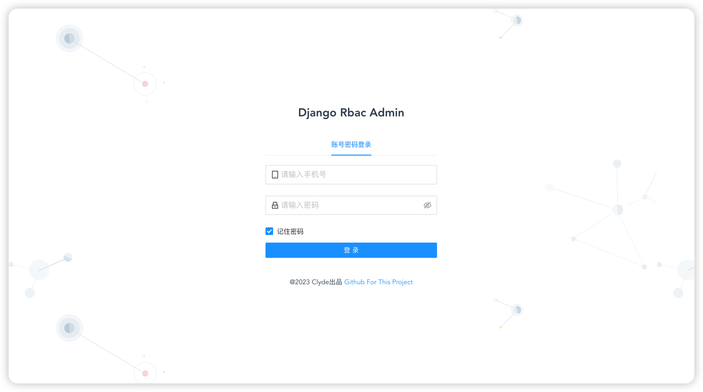
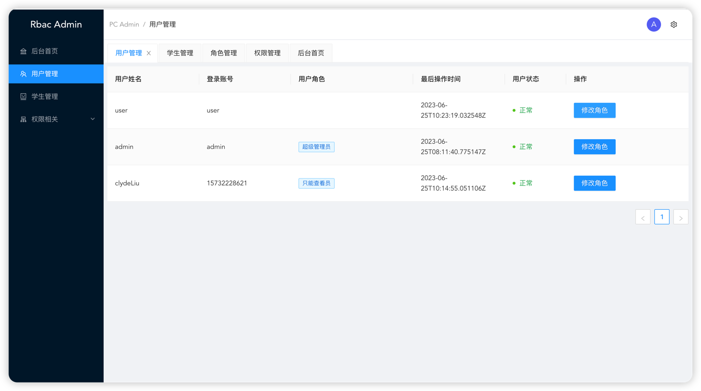
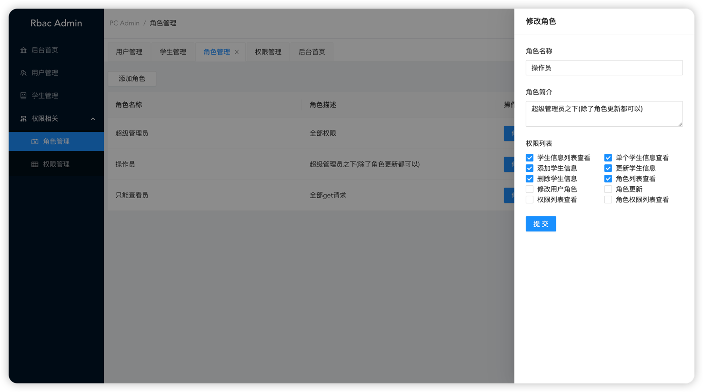

# drfRbac 权限管理


drfRbac是一个基于Django和Django REST Framework的RBAC（Role-Based Access Control）权限管理系统示例项目。RBAC是一种常见的权限管理模型，它通过角色的概念来组织和控制用户的访问权限。

该项目提供了一套完整的后端API和示例前端界面，用于管理和配置角色、权限和用户之间的关系。它旨在帮助开发人员理解和实现RBAC权限管理系统的核心概念和功能。

主要特性和功能:

角色管理: 可以创建、编辑和删除角色，为角色分配相应的权限。

权限管理: 可以创建、编辑和删除权限，定义系统中允许的操作和资源。

用户管理: 可以创建、编辑和删除用户，将用户分配到不同的角色。

用户角色管理: 可以查看和编辑用户所分配的角色，控制用户的访问权限。

登录和认证: 提供用户注册、登录和认证功能，使用token进行身份验证和访问令牌管理。

drfRbac项目采用现代化的技术栈，包括Django框架和Django REST Framework，使用Python编程语言开发。它提供了清晰的代码结构和丰富的文档，使开发人员能够快速上手并进行二次开发和定制。

通过该项目，你可以学习和了解RBAC权限管理模型的实现原理，以及如何在Django和Django REST Framework中构建和管理权限系统。你可以使用该项目作为基础，根据自己的需求进行功能扩展和定制，从而加速开发过程并提高系统的安全性和可扩展性。





## 项目配置（本地启动）

### 数据库

根目录创建`.env`文件，写入数据库配置信息

```
DB_NAME=drfRbac
DB_USER=root
DB_PASSWORD=12345678
DB_HOST=localhost
DB_PORT=3306
```

### 创建虚拟环境

```
# 创建名为 env 的虚拟环境
python3 -m venv env

# 激活环境
source env/bin/activate
```

使用Pycharm选择项目的创建虚拟环境，步骤....

### 安装相关库

终端执行命令

```
pip install -r requirements.txt
```

### 数据库迁移

```
python manage.py makemigrations

python manage.py migrate 
```

### 数据库同步rbac权限

```
python manage.py sync_permissions
```

### 项目启动

```
python manage.py runserver
```


管理 用户名：amdin 密码：admin

普通 用户名：user  密码：admin


### frontend 目录为前端文件

## docker-compose 部署

等待更新...